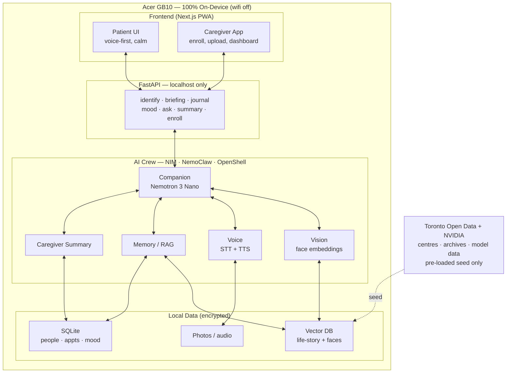
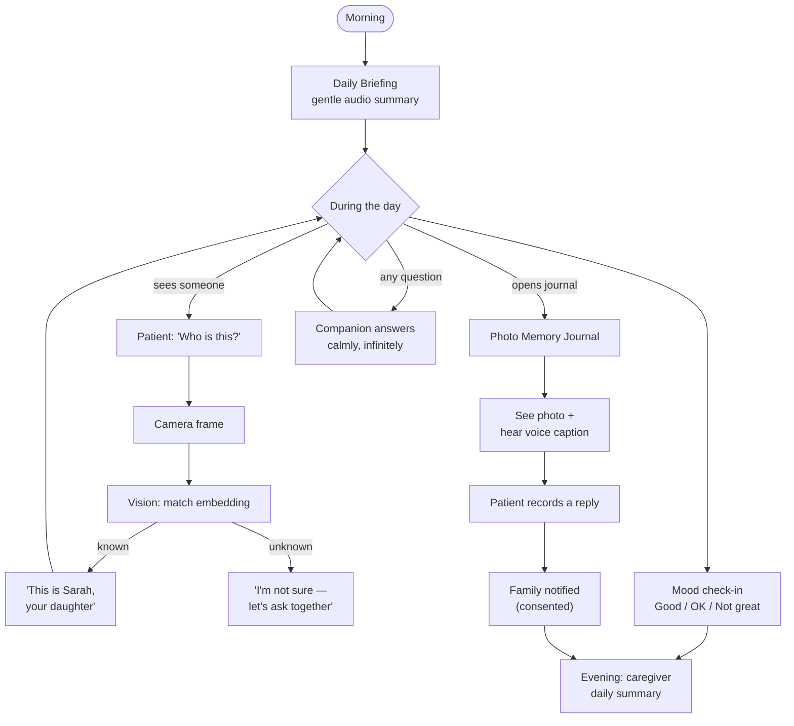
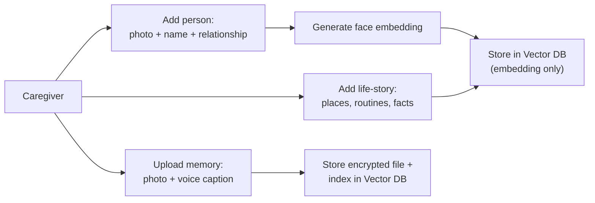

# Anchor — Project Specification
### *(working name — alternates: Kindred · Mira · Reverie)*

> ⚠️ **Historical design note — original hackathon spec, kept for context.** The app shipped as **Belong** on **Nemotron Nano 30B** + **Piper** TTS; some P0/P1 scoping below differs from what was built. Current source of truth: root [`README.md`](../../README.md) / [`CLAUDE.md`](../../CLAUDE.md); forward plan: [`docs/ROADMAP.md`](../ROADMAP.md).

**Team:** Dangerous · **Event:** The Spark Hack Series (NVIDIA) · **Track:** Public Services
**One-liner:** A 100% on-device AI companion that helps people with dementia recognize loved ones, stay oriented, and hold onto their story — with every byte of their life staying on the box.

---

## 1. The Idea

Dementia steals the most intimate things first: the faces of family, the thread of the day, the memories that make a life feel like *yours*. The tools that could help are exactly the tools families fear most, because they'd mean uploading your parent's face, voice, location, and medical life to someone else's cloud.

**Anchor removes that trade-off.** It runs entirely on the NVIDIA GB10 — no cloud, no account, no data leaving the device. The most private data imaginable never travels. We can run the entire live demo with the **wifi physically off**.

This is augmentation, not surveillance: it gives the person dignity and the caregiver relief, and the family owns and can delete every byte.

---

## 2. Project Overview

**The problem.** Two people suffer at once. The *person with dementia* faces fear and disorientation — not recognizing a daughter, asking the same question 30 times, losing the anchor of who/where/when. The *caregiver* burns out from infinite repetition and constant worry, with no safe tools they'd actually trust.

**Who it's for.**
- **The person (primary user):** voice-first, calm, dignified, low-cognitive-load UI. Never quizzed, never corrected harshly.
- **The caregiver (the buyer):** enrolls faces, builds the life story, uploads memories, sets the day, receives a gentle end-of-day summary.

**Why local / why now.** Privacy is the whole product — a dementia memory aid is the cleanest possible answer to "why must this run on-device?" The GB10 (Grace Blackwell) makes a full agent crew + vision + voice run offline, which was not feasible on consumer hardware before.

**Toronto Open Data (structural, not bolted-on).**
- **Parks & Recreation Facilities / community & recreation centres** (~152 city-run) via the Toronto Open Data API → "safe places to go today" + caregiver respite + orientation.
- **City of Toronto Archives** historical imagery → seeds the reminiscence engine with era- and neighbourhood-accurate imagery grounded to where the person actually lived.

**What success looks like.** A 90-second Hack Fair demo where a judge points the camera at a "family member," Anchor warmly says their name and relationship, plays a morning briefing, and surfaces a photo memory with a voice caption — all with the network disconnected.

---

## 3. Architecture

Everything below lives **inside the GB10 boundary**. Nothing crosses the network at runtime.

### 3.0 Stack at a glance (locked)

| Layer | Choice | Approach |
|---|---|---|
| **AI** | NVIDIA **NIM** + **Nemotron** (via **NemoClaw**) | All inference runs **on the DGX Spark (GB10)**. Models are served as **NIM microservices** — local, OpenAI-compatible endpoints; **NemoClaw + OpenShell** orchestrate the agent crew; **Nemotron 3 Nano** is the companion model. Fully offline. |
| **API** | **FastAPI** | Local Python API on the Spark. Bridges the web app to the NIM endpoints + agent crew. `localhost` only. |
| **Web** | **Next.js** (installable **PWA**) | Offline-capable via service worker; **push notifications** for reminders + family updates. Single app serving both the Patient UI and Caregiver surfaces. |
| **Data** | NVIDIA platform datasets + **Toronto Open Data** | Pre-loaded seed only (no runtime network). NVIDIA datasets for grounding/eval; Toronto Open Data API + City Archives for local services + reminiscence imagery. |

**Approach in one line:** *Next.js PWA → FastAPI → NIM-served Nemotron agents → local encrypted store, all resident on the DGX Spark.* The network is used only to **seed** data before the event; at runtime the box is self-contained.

> **PWA / push nuance:** on-device, scheduled reminders (briefings, appointments) fire **locally via the service worker** — so the offline demo holds. Cross-device family→patient push uses a push service *only when a connection is available*; it is never on the critical demo path.

### 3.1 AI Layer (the brain — NIM · NemoClaw · OpenShell)
A small multi-agent crew, orchestrated locally:

| Agent | Model / Tech | Owns |
|---|---|---|
| **Companion** | Nemotron 3 Nano | The warm, *errorless* conversational front. Simple language, reassurance, never quizzes or corrects harshly. Orchestrates the others. |
| **Vision** | Local face-embedding model (e.g. InsightFace) | "Who is this?" — matches a live frame to enrolled embeddings, returns name + relationship + a warm fact. |
| **Voice** | Local STT (Whisper-class) + local TTS (Piper-class) | Voice-first I/O: briefings, captions, patient replies. |
| **Memory / RAG** | Local vector store | Grounds every Companion reply in the person's real life-story + schedule. No hallucinated facts. |
| **Caregiver Summary** | Nemotron 3 Nano | Rolls the day's interactions into a gentle evening summary for family. |

Every model is served **on the DGX Spark as NVIDIA NIM microservices** (local, OpenAI-compatible). NemoClaw + the OpenShell sandbox host and orchestrate the crew; FastAPI calls the NIM endpoints — no model call ever leaves the box.

**Design rule (non-negotiable):** the Companion is *errorless by design*. It never tests memory, never says "don't you remember," never contradicts. It reassures and redirects. This is the difference between care and distress.

### 3.2 API Layer
A **FastAPI** server bound to **localhost only** — the contract between the web app and the agent crew, forwarding to the local NIM endpoints. Core endpoints:

- `POST /enroll` — add a person (photo → embedding) or a memory
- `POST /identify` — camera frame → identity + relationship + context
- `GET  /briefing` — today's gentle audio summary (appointments, contacts)
- `GET/POST /journal` — fetch memories / upload photo + voice caption / record patient reply
- `POST /mood` — Good / OK / Not great check-in
- `POST /ask` — open Companion Q&A (the infinite-patience loop)
- `GET  /summary` — caregiver end-of-day rollup

WebSocket channel for live voice + camera streaming.

### 3.3 Frontend Layer (two-sided — Next.js PWA + TS, Tailwind)
Installable PWA with a service worker for offline use and local scheduled notifications; optional push for family updates when online.
- **Patient UI:** voice-first, one action per screen, large high-contrast type, minimal taps. Core views: *Who is this?* (camera), *Daily Briefing*, *Memory Journal*. Optional R3F for spatial reminiscence visuals.
- **Caregiver App:** face enrollment (photo + name + relationship), life-story builder, journal upload with voice caption, appointments + emergency contact, mood dashboard, daily summary. This is the buyer-facing surface.

### 3.4 Data / Storage Layer (all local, encrypted at rest)
- **Seed datasets** (pre-loaded, no runtime network): **NVIDIA platform datasets** for grounding/eval + synthetic data; **Toronto Open Data** (community & recreation centres, neighbourhood profiles) + **City of Toronto Archives** imagery for reminiscence.
- **Vector DB** (Chroma / sqlite-vec): life-story knowledge + face embeddings (embeddings only — never raw photos in the index).
- **SQLite**: people, relationships, appointments, mood logs, journal metadata.
- **File store**: photos + audio, encrypted.
- **Dignity layer**: fully exportable + one-tap deletable by the family. Consent recorded on both sides.

### 3.5 Infrastructure
Acer Veriton GN100 / **NVIDIA GB10 Grace Blackwell (DGX Spark)**, NemoClaw reference stack + OpenShell sandbox, models served locally as **NVIDIA NIM** microservices. Runs fully offline — the demo runs with the network disconnected.

---

## 4. Features

### P0 — Build now (the demo, all pure on-device AI)
1. **"Who is this?"** — camera recognizes a loved one → *"This is Sarah, your daughter."* (Vision + Companion)
2. **Daily Memory Briefing** — a gentle morning audio summary: *"Today you see Dr. Lee at 2. John is your emergency contact."* (Memory + Voice)
3. **Photo Memory Journal** — family uploads a photo + voice caption; the person revisits it and can record a reply. (Journal + Voice — this is the reminiscence core and the AV showcase.)

### P1 — Supporting (build if time allows)
- **Mood check-ins** (Good / OK / Not great) — simple, demos well, feeds the caregiver summary.
- **Life-story enrollment** — caregiver populates people, places, routines (required to make P0 real).
- **Caregiver daily summary** — gentle evening rollup.
- **Toronto centre locator** — community & recreation centres (Toronto Open Data) as "safe places today" / respite.

### Roadmap — Mock in slides, do NOT build at the hackathon
Fall detection · GPS "guide me home" · heart-rate / vitals · live family dashboard · home-display (TV) deployment.
*Why deferred:* these need wearable/sensor hardware not present on a GB10 workstation, and a **live location + vitals dashboard reads as surveillance** — the opposite of our thesis. Reframe the family side around *consented peace-of-mind*, not tracking.

---

## 5. App Flow

### 5.1 System architecture (on-device boundary)

### 5.2 Daily experience flow (the hero loop)

### 5.3 Enrollment flow (caregiver, one-time setup)

---

## 6. Open Items
- [ ] Confirm team-size rule with organizers (Spark caps at 5; Dangerous is 7).
- [ ] Lock the project name.
- [ ] Assign seats 2–7 (Agent / Vision / Voice / Full-stack / Data-Infra / Pitch) once each member's strengths are known.
- [ ] Pre-load Toronto + NVIDIA seed data + 2–3 "demo family" enrollments before Sunday.
- [ ] Write the 90-second Hack Fair script.